# Git Flow

Bij git repositories waar meerdere teamleden aan werken wordt een gestandaardiseerde flow gevolgd.

- Er wordt per user story een nieuwe branch aangemaakt.
- Wanneer de user story af is, wordt hiervoor een pull request aangemaakt.
- Voordat de branch gemerged wordt valideert een ander teamlid of deze aan alle eisen voldoet.
  - Dit pull request volgt een template met de validatie-eisen.

Gedetailleerde flow:

```mermaid
flowchart TD
    Branch(Nieuwe branch)
    Merge[Dev met lokale branch mergen]
    Pr[Pull request aanmaken volgens template]
    List[Ander teamlid lokaal alle \n punten in checklist doornemen]
    Valid{Voldoet \nde PR aan \n alle eisen?}
    Edit[Pull request bijwerken]
    Done[Pull request mergen met dev]
    Branch --User story geïmplementeerd--> Merge
    Merge --> Pr
    Pr --> List
    List --> Valid
    Valid --Nee--> Edit
    Edit --> List
    Valid --Ja--> Done
```



## Pull Request Template

```md
## Description

{Related user story}

## Definition of Done

{Definition of Done assigned to user story}

## Criteria

- [ ] The pull request implements one user story.
- [ ] All code and documentation is in English.
- [ ] There is no unused/ unecessary code.
```